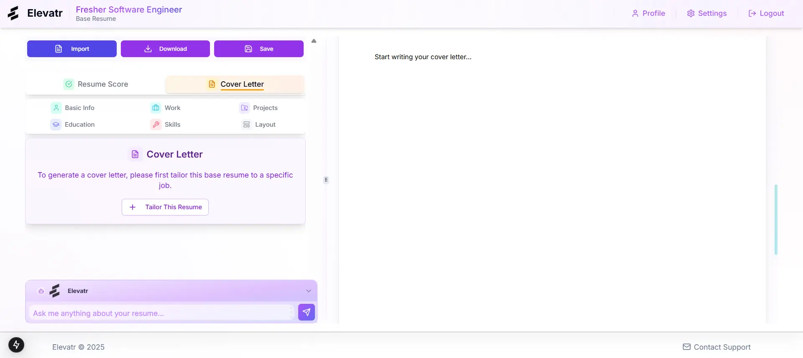
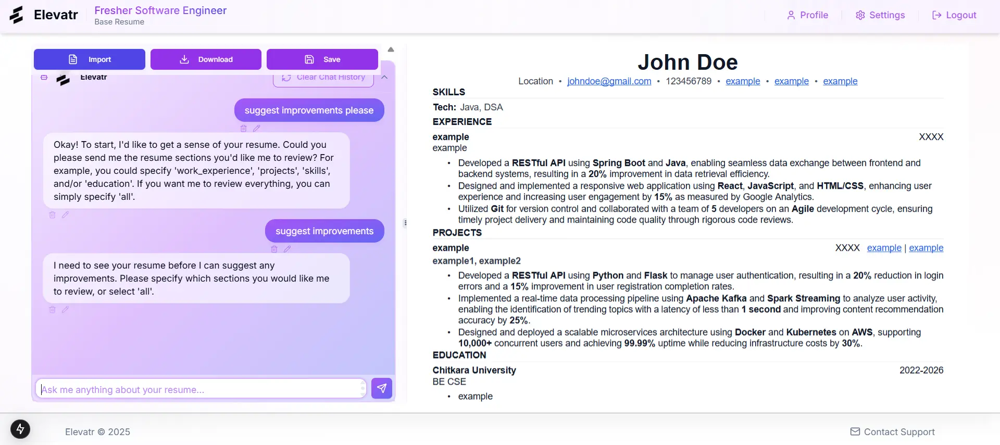
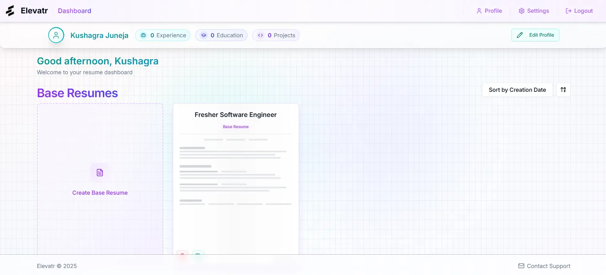

# Elevatr - AI-Powered Resume Builder

Try it out at [Elevatr.com](https://elevatr-a.vercel.app)!

> 🚧 **Under Active Development** 

An intelligent, open-source resume builder powered by AI that helps create and tailor resumes for specific job applications. Built with Next.js 15, React 19, TypeScript, and Shadcn UI.

## 🌟 Key Features

### Resume Management
- 📝 Two-tier resume system:
  - **Base Resumes**: Foundation templates for your professional profile
  - **Tailored Resumes**: AI-optimized versions for specific job applications
- 💼 Comprehensive section management for:
  - Work Experience
  - Education
  - Projects
  - Skills
- 📊 Resume scoring system to measure effectiveness
- 🗂️ Resume sorting and organization
- 📱 Mobile-first approach with responsive layouts
- 🎨 Modern, responsive design with soft gradient minimalist theme

### AI Integration
- 🤖 AI-powered content suggestions for all resume sections
- 💡 Smart content optimization and improvement recommendations
- 🎯 Intelligent job description analysis
- 💬 Interactive AI assistant for resume writing guidance
- ✨ Real-time content enhancement suggestions
- 🔄 Multiple AI model support (OpenAI, Claude, Gemini, DeepSeek, Groq)

### Cover Letter Generation
- 📝 Integrated cover letter editor
- 🤖 AI-assisted cover letter creation
- 🔄 Synchronized with resume data
- 📁 Export capabilities

### Profile Management
- 👤 User profile creation and management
- 🎓 Education history tracking
- 💼 Work experience management
- 🛠️ Skills inventory
- 🚀 Projects showcase

### Technical Features
- 🔒 Row Level Security (RLS) for data protection
- 🚀 Server-side rendering with Next.js 15 App Router
- 📄 PDF generation and preview
- 🎨 Custom design system with consistent UI/UX
- 🔄 Real-time updates and preview

## 🛠️ Tech Stack

### Frontend
- Next.js 15 (App Router)
- React 19
- TypeScript
- Shadcn UI Components
- Tailwind CSS
- React PDF

### AI & Data Processing
- OpenAI Integration
- Server Components for AI Processing
- Structured JSON Data Format

### Database
- PostgreSQL with Row Level Security
- Prisma ORM
- Supabase Auth